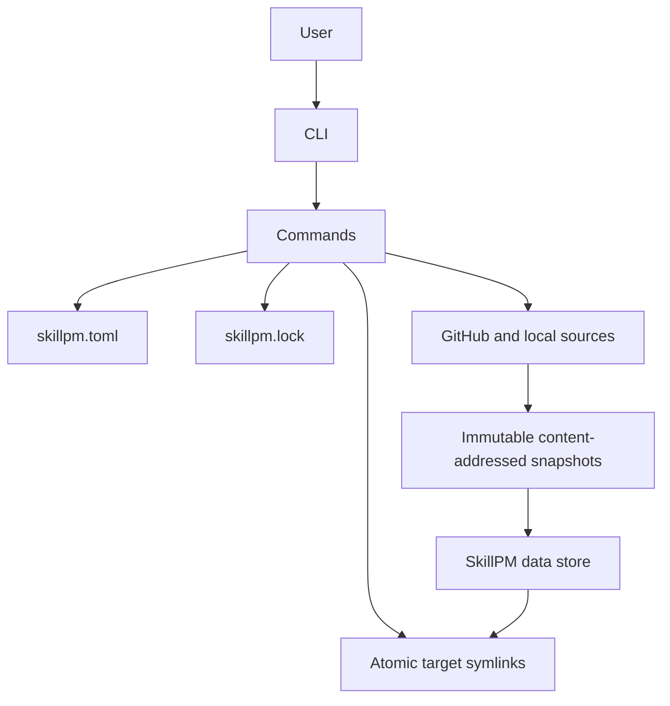

# SkillPM Implementation Plan

SkillPM is a small, declarative skill package manager for macOS and Linux.

A user declares skills once in a global `skillpm.toml`. SkillPM resolves GitHub and local sources into immutable snapshots, records exact versions in `skillpm.lock`, and installs skills by creating symlinks from each configured target to SkillPM's snapshot store.

SkillPM never copies source files directly into targets and never recursively deletes target directories. Speed, reproducibility, safety, and a minimal noninteractive CLI are the primary design goals.

## 1. Global paths

SkillPM uses one global configuration. It does not search the current directory and does not accept a config-path override.

| Purpose | Default | XDG override |
| --- | --- | --- |
| Config | `~/.config/skillpm/skillpm.toml` | `$XDG_CONFIG_HOME/skillpm/skillpm.toml` |
| Lockfile | `~/.config/skillpm/skillpm.lock` | `$XDG_CONFIG_HOME/skillpm/skillpm.lock` |
| Data root | `~/.local/share/skillpm` | `$XDG_DATA_HOME/skillpm` |
| Snapshot store | `~/.local/share/skillpm/store` | `$XDG_DATA_HOME/skillpm/store` |
| Operation lock | `~/.local/share/skillpm/.operation.lock` | `$XDG_DATA_HOME/skillpm/.operation.lock` |

`skillpm.toml` may itself be a symlink. SkillPM resolves it and atomically edits the real file without replacing the symlink. `skillpm.lock` remains at the logical global path.

All mutating commands take the single, nonblocking operation lock before reading state. If another SkillPM process holds it, the command fails immediately with a clear error.

SkillPM supports macOS and Linux in v1. Windows returns an unsupported-platform error rather than falling back to copied targets.

## 2. Configuration schema

`skillpm.toml` is human-authored and has an explicit schema version and one `skills` table.

```toml
version = 1

[skills.frontend-design]
source = "github:anthropics/skills/frontend-design"
ref = "main"
targets = [
  ".claude/skills/frontend-design",
  ".agents/skills/frontend-design",
]

[skills.my-local-skill]
source = "skills/my-local-skill"
targets = [
  ".claude/skills/my-local-skill",
]
```

Each skill has:

- `source`: required GitHub source or local path.
- `ref`: optional GitHub branch, tag, or full commit SHA; invalid for local sources.
- `targets`: required nonempty array of target paths.

The key under `skills` must exactly equal the validated `name` in the source's `SKILL.md`. Aliases are not supported.

Unknown top-level fields, unknown skill fields, unsupported config versions, duplicate targets, and empty target arrays are errors. `add` and `remove` preserve comments, ordering, and unrelated formatting instead of serializing the complete document again. SkillPM never silently migrates the human-authored config.

A conceptual Rust model is:

```rust
use std::collections::BTreeMap;
use std::path::PathBuf;

use serde::{Deserialize, Serialize};

#[derive(Debug, Serialize, Deserialize)]
#[serde(deny_unknown_fields)]
pub struct Config {
  pub version: u32,
  pub skills: BTreeMap<String, Skill>,
}

#[derive(Debug, Serialize, Deserialize)]
#[serde(deny_unknown_fields)]
pub struct Skill {
  pub source: String,
  pub r#ref: Option<String>,
  pub targets: Vec<PathBuf>,
}
```

### Path resolution

Local sources and targets accept:

- absolute paths;
- paths relative to the user's home directory;
- a leading `~/` spelling.

SkillPM normalizes `.` and repeated separators. It does not expand environment variables, globs, or non-leading tildes.

Existing symlinked parent directories are allowed. SkillPM canonicalizes existing parents for conflict detection, while preserving the configured spelling in `skillpm.toml`. Relative paths always use the home directory as their base, even when `skillpm.toml` is symlinked elsewhere.

## 3. Source model

SkillPM supports exactly two source forms.

### GitHub

```toml
source = "github:<owner>/<repo>/<optional-skill-path>"
```

The first two components are the owner and repository. Remaining components select the skill directory. Omitting the path selects a skill at the repository root.

SkillPM rejects absolute subpaths, traversal, empty components, query strings, and fragments. Full GitHub URLs and bare `owner/repo` shorthand are intentionally unsupported.

An optional `ref` is stored separately:

- omitted: resolve the remote default branch HEAD;
- branch: resolve the current branch HEAD;
- lightweight or annotated tag: resolve the underlying commit;
- full 40-character commit SHA: remain fixed;
- branch/tag name collision: reject as ambiguous.

`update` re-resolves movable refs. `install` uses only the exact commit in `skillpm.lock`.

### Local

Any non-`github:` source is a local path. Local sources are snapshots, not live links: SkillPM hashes and copies the source into its owned immutable store, then points targets at that stored copy. Editing a local source does not affect installed targets until `skillpm update`.

SkillPM excludes any entry named `.git` at any depth from a local snapshot. It does not apply broader ignore rules; `.gitignore`, `.gitattributes`, `node_modules`, hidden files, and other ordinary content are included.

## 4. Skill validation

Each selected source directory must contain a regular, UTF-8 `SKILL.md` with valid YAML frontmatter.

Required fields are:

- `name`: 1–64 lowercase ASCII letters, digits, and hyphens; no leading/trailing hyphen or consecutive hyphens;
- `description`: nonempty string of at most 1024 characters.

Other frontmatter fields are permitted and ignored. SkillPM preserves the original file bytes.

The config key and every target's final path component must equal the skill name. The original source directory name need not match, which permits a skill at a repository root.

## 5. Snapshot format and store

Both GitHub and local skills become the same content-addressed snapshot format:

```text
$XDG_DATA_HOME/skillpm/store/sha256/<hex-content-hash>/
```

The canonical SHA-256 input is versioned and domain-separated. Entries are sorted bytewise by normalized UTF-8 relative path. The hash includes:

- every directory path, including empty directories;
- every regular file's path, executable bit, length, and bytes;
- every symlink's path and stored destination text.

It excludes timestamps, ownership, Unicode normalization, and non-executable permission bits. Hard-linked files become independent regular files.

Snapshots support only directories, regular files, and safe relative symlinks. SkillPM rejects sockets, devices, FIFOs, absolute symlinks, escaping symlinks, symlink loops, non-UTF-8 paths, and non-UTF-8 symlink destinations. SkillPM never follows symlinks while hashing or materializing a snapshot.

Snapshot staging and hashing use exactly the same entry set. For a local update, SkillPM hashes the source again after staging and aborts the complete transaction if the source and staged snapshot differ.

Completed snapshots are made read-only while preserving executable files. Before linking a snapshot, `install` recomputes its hash. A corrupt snapshot is deleted and reconstructed from the locked source. A local snapshot can be reconstructed only when the current source still matches the locked hash.

After a successful `add`, `update`, or `remove`, SkillPM deletes every unreferenced snapshot. Pruning failure produces a warning but does not roll back an otherwise successful command.

## 6. Lockfile

`skillpm.lock` is generated, deterministic TOML and contains every GitHub and local skill.

```toml
version = 1

[skills.frontend-design]
source = "github:anthropics/skills/frontend-design"
ref = "main"
commit = "0123456789abcdef0123456789abcdef01234567"
content_hash = "sha256:..."

[skills.my-local-skill]
source = "skills/my-local-skill"
content_hash = "sha256:..."
```

Lock entries are sorted by skill name and contain no timestamps. `source` and `ref` mirror `skillpm.toml` for stale-lock detection. Targets are not locked, so target-only config changes do not require version resolution.

`install`, `add`, and `remove` require an exact lock entry set with matching source/ref data. Missing, extra, malformed, older, or stale lock state is an error. `update` may regenerate those forms from a valid config. A lockfile with a newer schema version is never overwritten by any command.

The lockfile is authoritative; the store is a disposable cache. If a GitHub snapshot is absent, `install` fetches the exact locked commit. If a local snapshot is absent, `install` reconstructs it only when the current source hash matches the lock.

## 7. GitHub acquisition

SkillPM requires the system `git` executable. It does not use libgit2, implement a GitHub API client, or invoke `gh`.

For each operation, SkillPM:

1. Groups GitHub skills by repository and requested ref.
2. Resolves refs with `git ls-remote`.
3. Skips content fetching when the resolved commit and verified snapshot are unchanged.
4. Performs one shallow, blob-filtered fetch per changed group.
5. Extracts each selected path from the exact commit using local `git archive`.
6. Validates and materializes each skill snapshot independently.
7. Deletes temporary Git data after snapshots commit.

If partial fetch is unsupported, SkillPM falls back to a normal `--depth 1` fetch. It never copies a working tree, so global checkout filters, line-ending settings, and `.git` metadata cannot alter snapshots.

SkillPM rejects selected skills containing Git submodules or Git LFS pointer files in v1 rather than installing incomplete content or invoking additional tools.

Up to four independent repository/local-source preparation jobs run concurrently. Output is buffered per source, and any failure cancels pending work before filesystem state commits.

Each Git subprocess has a five-minute timeout, overridable with `SKILLPM_GIT_TIMEOUT_SECONDS`. SkillPM performs no automatic network retry except authentication fallback and cleans temporary data after timeout or failure.

### Authentication

Git runs noninteractively with `GIT_TERMINAL_PROMPT=0`. Existing Git credential helpers may work normally. For GitHub authentication failures, SkillPM retries with `GITHUB_TOKEN`, then `GH_TOKEN`, passing credentials through child-process environment/config rather than URLs or command arguments.

SkillPM never prints tokens, credential headers, or credential-bearing errors. It does not inspect GitHub CLI credentials or add automatic SSH fallback behavior.

## 8. Target model

Every target is an absolute symlink to an immutable snapshot directory. SkillPM creates missing parent directories but never copies source contents into targets.

Installation rules are:

- missing target: create the symlink;
- correct existing symlink: no-op;
- other existing or dangling symlink: atomically replace the symlink without touching its destination;
- regular file or directory: fail the complete operation;
- no `--force` behavior.

Removal unlinks symlinks only. A missing target is already removed and is accepted. A regular file or directory at a configured target aborts removal. SkillPM never recursively deletes target directories or symlink destinations and never removes target parents during normal removal.

Before fetching or committing, SkillPM validates the complete target graph and rejects:

- duplicate targets, including differently spelled paths that normalize to one location;
- targets shared by different skills;
- ancestor/descendant target overlap;
- overlap with the config directory or SkillPM data directory;
- overlap with any configured local source;
- a target basename that differs from the skill name.

If a failed transaction created target parents, rollback removes only parents created by that transaction that are still empty.

## 9. CLI

The executable has exactly four noninteractive commands:

```text
skillpm install
skillpm update
skillpm add <source> --target <path>... [--ref <ref>]
skillpm remove <name>
```

There is no config flag, force flag, name alias, selective install/update, JSON mode, quiet mode, or interactive mode in v1.

Progress and diagnostics go to stderr. A concise success summary goes to stdout. Color is enabled only when stderr is a terminal and is disabled by `NO_COLOR`.

### `skillpm install`

`install` reproduces `skillpm.lock` without changing versions or lock metadata:

1. Load and strictly validate config and lock state.
2. Validate all target paths.
3. Verify every referenced snapshot.
4. Reconstruct missing/corrupt snapshots at their exact locked versions.
5. Atomically create or repair all target symlinks.

It avoids network access when all snapshots exist and avoids rewriting correct symlinks.

### `skillpm update`

`update` is the only command that resolves new versions or repairs stale lock metadata:

1. Load and validate `skillpm.toml`.
2. Resolve every GitHub ref and hash every local source.
3. Reuse unchanged snapshots and stage changed snapshots.
4. Generate a complete replacement lockfile.
5. Install every locked snapshot into every target.
6. Commit the lockfile and target changes as one in-process transaction.
7. Prune unreferenced snapshots.

A missing, malformed, stale, or older lockfile is regenerated. An unchanged update avoids unnecessary snapshot, lockfile, and symlink writes.

### `skillpm add`

```text
skillpm add <source> --target <path>... [--ref <ref>]
```

At least one target is required, and `--ref` is valid only for GitHub sources. SkillPM fetches and validates a new source before editing config.

For a new skill, `add`:

1. Derives the name from `SKILL.md`.
2. Resolves and snapshots the source.
3. Adds the skill to `skillpm.toml` without disturbing unrelated formatting.
4. Adds the exact version to `skillpm.lock`.
5. Installs all targets.

`add` is the only command that bootstraps an absent config, lockfile, and data directories.

When the same source/ref is already configured, `add` merges and deduplicates new targets, then installs the existing locked version. It does not update the version. An identical invocation is an idempotent no-op/install check. A name collision from a different source/ref is an error and requires explicit removal first.

Once a config exists, `add` requires fresh complete lock state before making changes.

### `skillpm remove`

```text
skillpm remove <name>
```

An unknown name is an error. SkillPM preflights every configured target, unlinks present symlinks, removes the config and lock entries, and prunes the snapshot when no longer referenced. Missing target links are accepted. Ordinary failures roll back links and metadata.

Removing the final skill leaves valid empty `skillpm.toml` and `skillpm.lock` files.

## 10. Transaction and race model

Every command stages all fallible source, snapshot, config, lock, and symlink work before committing visible state. Individual file writes and symlink replacements use temporary siblings and atomic renames. The coordinator retains enough backup information to roll back ordinary runtime failures.

SkillPM does not maintain a persistent crash-recovery journal. A process kill or power loss may require rerunning the command, but atomic writes and convergent operations prevent partially written metadata. No operation overwrites or recursively removes target files/directories.

Immediately before commit, SkillPM re-reads config and lock bytes and rechecks target entry types. It aborts if ordinary external edits are detected. The v1 threat model does not attempt platform-specific hardening against a malicious process already running as the same user and deliberately racing filesystem operations.

## 11. Program components

Keep low-level behavior in small independent modules and orchestration in commands:

```text
CLI
 │
 ▼
Commands
 ├── Paths and process lock
 ├── Config document
 ├── Lockfile
 ├── Source parser and skill validator
 ├── Git resolver/acquirer
 ├── Snapshot and store
 ├── Target planner/installer
 └── Transaction coordinator
```

Suggested modules:

```text
src/
  main.rs
  cli.rs
  paths.rs
  config.rs
  lockfile.rs
  source.rs
  skill.rs
  github.rs
  snapshot.rs
  store.rs
  targets.rs
  transaction.rs
  commands/
    mod.rs
    install.rs
    update.rs
    add.rs
    remove.rs
```

`Commands` owns workflow and transaction ordering. Parsing, hashing, Git, store, and target modules expose focused operations and do not call commands or each other implicitly.



## 12. Completion criteria

The implementation is complete when unit and integration tests demonstrate:

- deterministic parsing, lock generation, and snapshot hashes;
- reproducible offline installs from a populated store;
- exact locked reconstruction after cache deletion;
- local and GitHub updates with unchanged fast paths;
- strict source, skill, config, lock, and target validation;
- no replacement or deletion of regular target files/directories;
- rollback of ordinary failures across multiple skills and targets;
- config comment preservation and symlinked-config support;
- concurrent-command exclusion;
- authentication redaction, timeout cleanup, and Git fallback behavior;
- automatic pruning and read-only snapshot integrity;
- idempotent `install`, `update`, and repeated identical `add` behavior.
